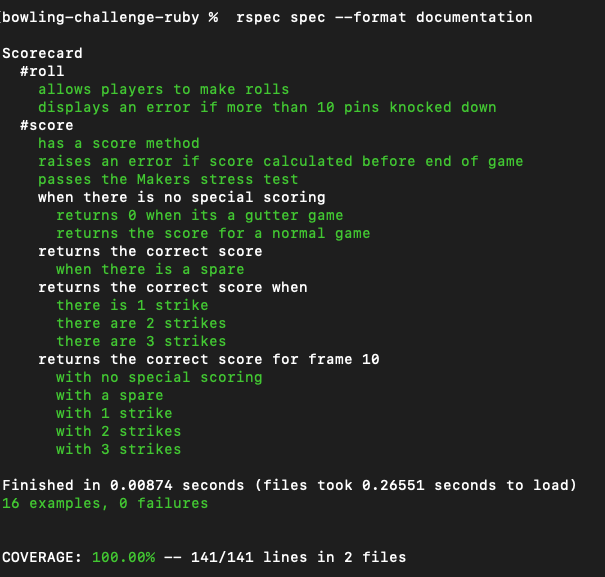

# Bowling scorecard 

```
              .-.
              \ /      .-.
              |_|  .-. \ /
              |=|  \ / |_|
             /   \ |_| |=|
            / (@) \|=|/   \
       ____ |     /   \@)  \
     .'    '.    / (@) \   |
    / #      \   |     |   |
    |    o o |'='|     |  /
    \     o  /    \   /'='
     '.____.'      '=
 ```

## Introduction 

This is my solution to the week 5 Makers weekend challenge which is to build a bowling scorecard app. 

The focus of this exercise is on:
- TDD
- Testing behaviour rather than state
- Commiting often with good commit messages
- SRP & encapsulation
- Clear and readable code

Given the focus above, only the model was built in Ruby with no development of a web-based app.

## Solution design

A lot of time was spent on the front end going through the program requirement in detail and mapping out the potential scoring permutations.

The code was built entirely through TDD enuring the simplest code was being used to pass the test and nothing more. This can be seen in the commit history which clearly shows incremental code updates.

This led to the design naturally evolving once the base logic of score calculation was developed.

The scoring rules follow the traditional rules that can be found [here](https://en.wikipedia.org/wiki/Ten-pin_bowling#Traditional_scoring)

## How to use

#### To set up the project

Clone this repo and then run 

```
bundle install
```

#### To calculate bowling score

Open IRB and load the 'scorecard.rb' file in the 'lib' folder. Instantiate a Scorecard by calling Scorecard.new. 

```
bowling-challenge-ruby % irb
2.7.3 :001 > require './lib/scorecard.rb'
 => true 
2.7.3 :002 > s = Scorecard.new
 => #<Scorecard:0x00007fc7b12bb198 @rolls=[], @total=0> 
```

Add a the number of pins knocked down in your roll with the .roll() method

```
2.7.3 :003 > s.roll(3)
 => [3] 
2.7.3 :004 > s.roll(3)
 => [3, 3] 
```

The Scorecard knows when there is a strike or spare. When there is a strike, enter the pins knocked down and then move on to the next frame. The program will automatically assign a score of 0 to roll 2 of that frame.

```
2.7.3 :005 > s.roll(10)
 => [3, 3, 10, 0] 
```

For the last frame, enter the rolls as normal. The program has built in logic to detect if frame 10 has strikes or spares.

The score can only be determined at the end of a game (10 frames completed). To find out the score use the .score() method

```
2.7.3 :009 > s.score
 => 16 
```

## Testing

All testing was carried out in RSpec. To run the tests, navigate to the root directory and in the command line type 

```
rspec 
```

A summary of the tests is as follows:


## Improvements

Time permitting I would look to make the following changes:
 - Seperate the game logic from score calculation into two seperate classes
 - Add further error checking logic for the following:
  - no more than 10 pins rolled per frame
  - no more than 10 frames per game